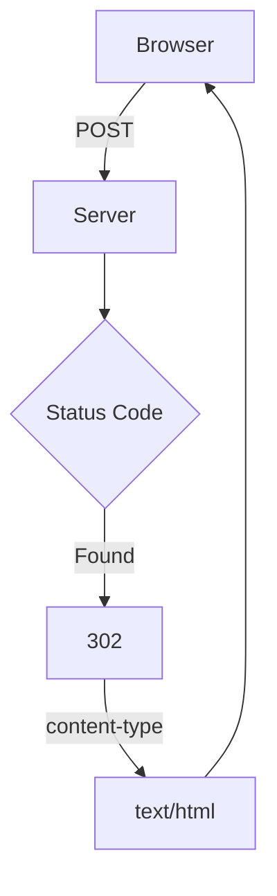

## Resolution: 

Rascunho

    new_note
        General
            Request URL: https://studies.cs.helsinki.fi/exampleapp/new_note
            Request Method: POST
            Status Code: 302 

        Response Header
            content-type: text/html; charset=utf-8

    notes
        General
            Request URL: https://studies.cs.helsinki.fi/exampleapp/notes
            Request Method: GET
            Status Code: 200 

        Response Header
            content-type: text/html; charset=utf-8

    main.css
        General
            Request URL: https://studies.cs.helsinki.fi/exampleapp/main.css
            Request Method: GET
            Status Code: 200 

        Response Header
            content-type: text/css; charset=UTF-8

    main.js
        General
            Request URL: https://studies.cs.helsinki.fi/exampleapp/main.js
            Request Method: GET
            Status Code: 200 

        
        Response Header
            content-type: application/javascript; charset=UTF-8

    data.json
        General
            Request URL: https://studies.cs.helsinki.fi/exampleapp/data.json
            Request Method: GET
            Status Code: 200 

        Response Header
            content-type: application/json; charset=utf-8

        {"content":"ascariasisband","date":"2023-05-09T21:20:01.893Z"}