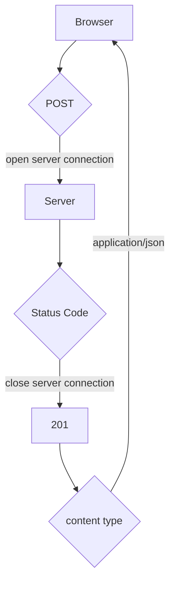

# 0.5: Diagrama de SPA

Crie um diagrama que retrate o contexto em que o usuário utilize a versão de aplicação de página única das notas em https://studies.cs.helsinki.fi/exampleapp/spa.

General
    Request URL: https://studies.cs.helsinki.fi/exampleapp/new_note_spa
    Request Method: POST
    Status Code: 201 

Response Headers
    content-type: application/json;